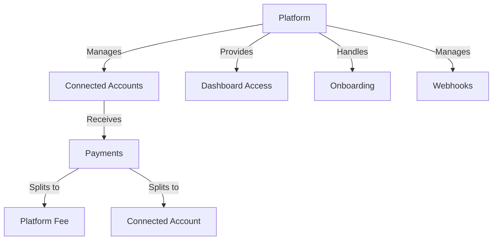

# Notch Pay Sync API - Detailed Report

## Executive Summary

**Test Date:** 2025-12-13  
**Test Status:** Documentation Analysis (Not explicitly tested)  
**API Category:** Sync (Platform/Marketplace Integration)  
**Overall Score:** N/A (Requires specific platform setup)

## Introduction

Notch Pay Sync is designed for platforms and marketplaces that need to facilitate payments between multiple parties, manage connected accounts, and handle payment splitting. This report analyzes the Sync functionality based on the provided documentation and provides implementation recommendations.

## Sync Overview

### What is Sync?

**Sync** is Notch Pay's solution for:
1. **Platform Payments** - Facilitating transactions between buyers and sellers
2. **Connected Accounts** - Managing multiple merchant accounts
3. **Payment Splitting** - Automatically distributing funds
4. **Commission Management** - Handling platform fees
5. **Multi-party Transactions** - Complex payment flows

### Sync Use Cases

| Use Case | Description | Example |
|----------|-------------|---------|
| **Marketplace** | Platform connecting buyers and sellers | E-commerce marketplace |
| **Service Platform** | Platform connecting service providers and clients | Freelance platform |
| **Rental Platform** | Platform connecting property owners and renters | Vacation rental site |
| **Subscription Platform** | Platform with multiple content creators | Membership site |
| **Donation Platform** | Platform connecting donors and causes | Crowdfunding site |

### Sync vs Standard API

| Feature | Sync API | Standard API |
|---------|----------|--------------|
| **Account Management** | Multiple connected accounts | Single merchant account |
| **Payment Flow** | Multi-party transactions | Direct merchant-customer |
| **Fee Handling** | Automatic splitting | Manual fee calculation |
| **Onboarding** | Connected account onboarding | Single merchant onboarding |
| **Complexity** | Higher (platform-level) | Lower (merchant-level) |
| **Use Case** | Platforms/marketplaces | Individual merchants |

## Sync Architecture

### Sync Components



### Sync Data Flow

```
1. Platform creates connected account for seller
2. Platform onboard seller (collects business info)
3. Buyer makes payment through platform
4. Sync automatically splits payment
5. Platform receives commission
6. Seller receives payout
7. Webhooks notify all parties
8. All parties can view transactions in dashboards
```

## Sync API Endpoints Analysis

### Account Management Endpoints

1. **Create Connected Account**
   - **Endpoint:** `POST /accounts`
   - **Purpose:** Create account for seller/service provider
   - **Authentication:** Platform API key

2. **Onboard Connected Account**
   - **Endpoint:** `POST /accounts/{id}/onboarding`
   - **Purpose:** Generate onboarding link for account holder
   - **Authentication:** Platform API key

3. **Generate Dashboard Link**
   - **Endpoint:** `POST /sync/accounts/{id}/dashboard`
   - **Purpose:** Provide seller access to their dashboard
   - **Authentication:** Platform API key

### Payment Processing Endpoints

1. **Create Payment with Splitting**
   - **Endpoint:** `POST /payments`
   - **Purpose:** Create payment with automatic splitting
   - **Authentication:** Platform API key

2. **Retrieve Payment**
   - **Endpoint:** `GET /payments/{reference}`
   - **Purpose:** Get payment details including splits
   - **Authentication:** Platform API key

### Transfer Management Endpoints

1. **Create Transfer to Connected Account**
   - **Endpoint:** `POST /transfers`
   - **Purpose:** Transfer funds to connected account
   - **Authentication:** Platform API key + X-Grant

2. **Retrieve Transfer**
   - **Endpoint:** `GET /transfers/{id}`
   - **Purpose:** Get transfer details
   - **Authentication:** Platform API key + X-Grant

### Webhook Endpoints

1. **List Webhooks**
   - **Endpoint:** `GET /webhooks`
   - **Purpose:** List all webhook endpoints
   - **Authentication:** Platform API key

2. **Create Webhook**
   - **Endpoint:** `POST /webhooks`
   - **Purpose:** Set up webhook for Sync events
   - **Authentication:** Platform API key

## Connected Account Management

### Account Types

1. **Standard Account**
   - Full featured account
   - Complete onboarding required
   - Full dashboard access

2. **Express Account**
   - Simplified onboarding
   - Limited features
   - Quick setup

3. **Custom Account**
   - Platform-defined account type
   - Custom onboarding flow
   - Special requirements

### Account Creation Example

```json
{
  "type": "standard",
  "business_profile": {
    "name": "Seller Store",
    "url": "https://sellerstore.com",
    "category": "retail"
  },
  "email": "seller@example.com",
  "phone": "+237600000000",
  "metadata": {
    "seller_id": "12345",
    "internal_reference": "SELLER_12345"
  }
}
```

### Onboarding Process

```python
def onboard_connected_account(account_id):
    """Generate onboarding link for connected account"""
    
    # Request onboarding link
    response = make_request(
        f"/accounts/{account_id}/onboarding",
        "POST",
        {
            "callback": "https://your-platform.com/onboarding-complete",
            "refresh_url": "https://your-platform.com/onboarding-refresh"
        }
    )
    
    if response.status == 200:
        onboarding_url = response["url"]
        
        # Redirect seller to onboarding
        return {
            "success": True,
            "onboarding_url": onboarding_url,
            "account_id": account_id
        }
    else:
        return {
            "success": False,
            "error": response["message"]
        }
```

## Payment Splitting Analysis

### Splitting Models

1. **Fixed Fee Splitting**
   ```json
   {
     "application_fee": 500,  // 500 XAF fixed fee
     "destination": {
       "account": "ben_123456789",
       "amount": 9500  // Remaining amount after fee
     }
   }
   ```

2. **Percentage Splitting**
   ```json
   {
     "application_fee_percent": 10,  // 10% fee
     "destination": {
       "account": "ben_123456789"
       // Amount calculated automatically
     }
   }
   ```

3. **Combined Splitting**
   ```json
   {
     "application_fee": 300,  // 300 XAF fixed fee
     "application_fee_percent": 5,  // 5% fee
     "destination": {
       "account": "ben_123456789"
       // Amount calculated automatically
     }
   }
   ```

### Payment with Splitting Example

```json
{
  "amount": 10000,
  "currency": "XAF",
  "customer": {
    "name": "John Doe",
    "email": "john@example.com"
  },
  "description": "Payment for Order #123",
  "reference": "order_123",
  "application_fee": 1000,  // Platform fee (10%)
  "destination": {
    "account": "acct_123456789",  // Connected account ID
    "amount": 9000  // Amount to transfer to seller
  }
}
```

### Splitting Calculation

```python
def calculate_split_amount(total_amount, fee_amount=None, fee_percent=None):
    """Calculate split amounts for platform and seller"""
    
    platform_fee = 0
    seller_amount = total_amount
    
    # Calculate fixed fee
    if fee_amount:
        platform_fee += fee_amount
        seller_amount -= fee_amount
    
    # Calculate percentage fee
    if fee_percent:
        percentage_fee = int(total_amount * fee_percent / 100)
        platform_fee += percentage_fee
        seller_amount -= percentage_fee
    
    # Ensure seller gets at least minimum amount
    if seller_amount < 0:
        seller_amount = 0
    
    return {
        "platform_fee": platform_fee,
        "seller_amount": seller_amount,
        "total": total_amount
    }
```

## Fee Management Strategies

### Fee Structure Examples

1. **Simple Percentage Fee**
   - Platform takes 10% of each transaction
   - Easy to understand and implement
   - Scales with transaction size

2. **Tiered Fee Structure**
   ```python
   def calculate_tiered_fee(amount):
       if amount < 5000:
           return int(amount * 0.12)  # 12% for small amounts
       elif amount < 20000:
           return int(amount * 0.10)  # 10% for medium amounts
       else:
           return int(amount * 0.08)  # 8% for large amounts
   ```

3. **Fixed + Percentage Fee**
   - Fixed fee (e.g., 300 XAF) + Percentage (e.g., 5%)
   - Covers costs while scaling with transaction size

4. **Subscription-Based Fees**
   - Monthly subscription fee for sellers
   - Lower or no transaction fees

### Fee Implementation Example

```python
class FeeCalculator:
    def __init__(self, fee_structure):
        self.fee_structure = fee_structure
    
    def calculate_fee(self, amount, account_type=None):
        """Calculate fee based on structure and account type"""
        
        if self.fee_structure == "simple_percentage":
            return int(amount * 0.10)  # 10%
            
        elif self.fee_structure == "tiered":
            if amount < 5000:
                return int(amount * 0.12)
            elif amount < 20000:
                return int(amount * 0.10)
            else:
                return int(amount * 0.08)
                
        elif self.fee_structure == "combined":
            fixed_fee = 300
            percentage_fee = int(amount * 0.05)
            return fixed_fee + percentage_fee
            
        elif self.fee_structure == "account_type_based":
            if account_type == "premium":
                return int(amount * 0.07)  # 7% for premium
            else:
                return int(amount * 0.10)  # 10% for standard
                
        return 0  # Free
```

## Webhook Integration for Sync

### Sync-Specific Webhook Events

1. **account.created** - New connected account created
2. **account.updated** - Connected account updated
3. **account.application.deauthorized** - Account deauthorized
4. **payment.succeeded** - Payment successful (with splitting)
5. **payment.failed** - Payment failed
6. **transfer.created** - Transfer initiated to connected account
7. **transfer.complete** - Transfer successful
8. **transfer.failed** - Transfer failed

### Sync Webhook Handling Example

```python
@webhook_route
def handle_sync_webhook():
    """Handle Sync-specific webhook events"""
    
    # Verify signature
    if not verify_webhook_signature():
        return "Invalid signature", 400
        
    event = request.json
    event_type = event['type']
    event_data = event['data']
    
    # Handle account events
    if event_type == 'account.created':
        handle_account_created(event_data)
        
    elif event_type == 'account.updated':
        handle_account_updated(event_data)
        
    elif event_type == 'account.application.deauthorized':
        handle_account_deauthorized(event_data)
        
    # Handle payment events
    elif event_type == 'payment.succeeded':
        handle_payment_succeeded(event_data)
        
    elif event_type == 'payment.failed':
        handle_payment_failed(event_data)
        
    # Handle transfer events
    elif event_type == 'transfer.created':
        handle_transfer_created(event_data)
        
    elif event_type == 'transfer.complete':
        handle_transfer_complete(event_data)
        
    elif event_type == 'transfer.failed':
        handle_transfer_failed(event_data)
        
    # Always acknowledge receipt
    return "Webhook received", 200

def handle_payment_succeeded(payment_data):
    """Handle successful payment with splitting"""
    
    payment_id = payment_data['id']
    reference = payment_data['reference']
    amount = payment_data['amount']
    
    # Get splitting details
    application_fee = payment_data.get('application_fee', 0)
    destination_amount = payment_data.get('destination', {}).get('amount', 0)
    
    # Calculate platform revenue
    platform_revenue = application_fee
    seller_revenue = destination_amount
    
    # Update platform records
    record_platform_revenue(payment_id, platform_revenue)
    
    # Update seller records
    seller_account = payment_data.get('destination', {}).get('account')
    record_seller_revenue(seller_account, seller_revenue)
    
    # Notify seller
    send_seller_notification(seller_account, reference, seller_revenue)
    
    # Update analytics
    track_successful_payment(amount, platform_revenue, seller_revenue)
```

## Dashboard Access for Connected Accounts

### Dashboard Features

1. **Transaction History** - View all payments and transfers
2. **Balance Information** - Available and pending balances
3. **Payout Management** - Configure payout preferences
4. **Business Information** - Update business details
5. **Notification Settings** - Configure alerts
6. **Dispute Management** - Handle payment disputes
7. **Reporting** - Generate financial reports

### Dashboard Access Implementation

```python
def generate_seller_dashboard_link(seller_account_id):
    """Generate dashboard access link for seller"""
    
    # Request dashboard link from Sync API
    response = make_request(
        f"/sync/accounts/{seller_account_id}/dashboard",
        "POST",
        {
            "redirect_url": "https://your-platform.com/seller/dashboard"
        }
    )
    
    if response.status == 200:
        dashboard_url = response["url"]
        
        # Store dashboard access record
        record_dashboard_access(seller_account_id, dashboard_url)
        
        return {
            "success": True,
            "dashboard_url": dashboard_url
        }
    else:
        return {
            "success": False,
            "error": response.get("message", "Unknown error")
        }
```

## Security Considerations for Sync

### Enhanced Security Requirements

1. **API Key Security**
   - Platform API keys have elevated privileges
   - Never expose in client-side code
   - Use environment variables or secure vault

2. **Connected Account Isolation**
   - Ensure accounts can only access their own data
   - Implement proper access controls
   - Prevent cross-account data leaks

3. **Webhook Signature Verification**
   - Critical for Sync operations
   - Prevent spoofed webhook attacks
   - Use timing-safe comparison

4. **Dashboard Access Control**
   - Dashboard links should be single-use
   - Implement proper authentication
   - Monitor for suspicious access

### Security Best Practices

```python
# Secure API key management
PLATFORM_PUBLIC_KEY = os.environ.get('NOTCHPAY_PLATFORM_PUBLIC_KEY')
PLATFORM_PRIVATE_KEY = os.environ.get('NOTCHPAY_PLATFORM_PRIVATE_KEY')

# Secure request function
def make_secure_sync_request(endpoint, method, data=None):
    """Make secure request to Sync API"""
    
    headers = {
        "Authorization": PLATFORM_PUBLIC_KEY,
        "X-Grant": PLATFORM_PRIVATE_KEY,
        "Content-Type": "application/json"
    }
    
    # Implement request signing
    if data:
        signature = generate_request_signature(data)
        headers["X-Request-Signature"] = signature
    
    # Make request with timeout
    try:
        response = requests.request(
            method,
            f"{BASE_URL}{endpoint}",
            headers=headers,
            json=data,
            timeout=30
        )
        
        # Verify response signature
        if not verify_response_signature(response):
            raise SecurityError("Invalid response signature")
            
        return response.json(), response.status_code
        
    except requests.exceptions.RequestException as e:
        # Handle network errors securely
        log_security_event("request_failed", str(e))
        return {"error": "Network error"}, 0
```

## Error Handling for Sync

### Common Sync Errors

1. **Account Creation Errors**
   - Invalid business information
   - Duplicate account
   - Compliance issues

2. **Onboarding Errors**
   - Incomplete onboarding
   - Invalid documents
   - Verification failures

3. **Payment Splitting Errors**
   - Invalid account for destination
   - Insufficient funds for splitting
   - Invalid fee amounts

4. **Transfer Errors**
   - Account not eligible for transfers
   - Transfer limits exceeded
   - Compliance restrictions

### Comprehensive Error Handling

```python
def handle_sync_error(error_type, error_data, context=None):
    """Handle Sync-specific errors"""
    
    # Log error with context
    log_sync_error(error_type, error_data, context)
    
    # Determine error severity
    severity = determine_error_severity(error_type)
    
    # Handle by error type
    if error_type == "account_creation_failed":
        # Account creation error
        account_id = context.get('account_id')
        notify_platform_admin("Account creation failed", error_data)
        notify_seller(account_id, "onboarding_issue", error_data)
        
    elif error_type == "onboarding_failed":
        # Onboarding error
        account_id = context.get('account_id')
        onboarding_url = generate_new_onboarding_link(account_id)
        notify_seller(account_id, "onboarding_failed", {
            "error": error_data,
            "onboarding_url": onboarding_url
        })
        
    elif error_type == "payment_splitting_failed":
        # Payment splitting error
        payment_id = context.get('payment_id')
        refund_payment(payment_id)
        notify_buyer(payment_id, "payment_failed", error_data)
        notify_seller(context.get('seller_id'), "payment_failed", error_data)
        
    elif error_type == "transfer_failed":
        # Transfer error
        transfer_id = context.get('transfer_id')
        retry_transfer(transfer_id)
        notify_seller(context.get('seller_id'), "transfer_delayed", error_data)
        
    elif error_type == "compliance_issue":
        # Compliance error (most severe)
        account_id = context.get('account_id')
        freeze_account(account_id)
        notify_compliance_team(error_data)
        notify_seller(account_id, "account_issue", {
            "message": "Your account requires attention",
            "contact_support": True
        })
        
    # Update error metrics
    update_error_metrics(error_type, severity)
    
    # Return appropriate response
    return generate_error_response(error_type, severity)
```

## Performance Optimization for Sync

### Performance Challenges

1. **High Volume of Connected Accounts**
2. **Complex Payment Flows**
3. **Real-time Webhook Processing**
4. **Dashboard Access Management**

### Optimization Strategies

1. **Caching Connected Account Data**
   ```python
   @cache(ttl=300)
   def get_connected_account(account_id):
       # Cache account data to reduce API calls
   ```

2. **Batching Account Updates**
   ```python
   def update_accounts_batch(account_updates):
       # Update multiple accounts in single request
   ```

3. **Asynchronous Webhook Processing**
   ```python
   @background_task
   def process_sync_webhook_async(webhook_data):
       # Process webhooks in background
   ```

4. **Connection Pooling**
   ```python
   # Reuse HTTP connections for Sync API calls
   ```

## Analytics and Reporting for Sync

### Key Metrics to Track

```python
SYNC_METRICS = {
    "connected_accounts": {
        "total": 0,
        "active": 0,
        "pending_onboarding": 0,
        "frozen": 0
    },
    "payments": {
        "total": 0,
        "successful": 0,
        "failed": 0,
        "platform_revenue": 0,
        "seller_revenue": 0
    },
    "transfers": {
        "total": 0,
        "successful": 0,
        "failed": 0,
        "pending": 0
    },
    "fees": {
        "total": 0,
        "average": 0,
        "by_type": {}
    },
    "onboarding": {
        "completion_rate": 0,
        "average_time": 0,
        "drop_off_points": {}
    }
}
```

### Analytics Implementation

```python
def track_sync_metrics(event_type, data):
    """Track Sync-specific metrics"""
    
    if event_type == "account_created":
        increment_metric("connected_accounts.total")
        increment_metric("connected_accounts.pending_onboarding")
        
    elif event_type == "onboarding_completed":
        increment_metric("connected_accounts.active")
        decrement_metric("connected_accounts.pending_onboarding")
        update_average("onboarding.average_time", data.get("duration"))
        
    elif event_type == "payment_processed":
        increment_metric("payments.total")
        if data.get("status") == "success":
            increment_metric("payments.successful")
            add_to_metric("payments.platform_revenue", data.get("platform_fee", 0))
            add_to_metric("payments.seller_revenue", data.get("seller_amount", 0))
        else:
            increment_metric("payments.failed")
            
    elif event_type == "transfer_processed":
        increment_metric("transfers.total")
        if data.get("status") == "success":
            increment_metric("transfers.successful")
        else:
            increment_metric("transfers.failed")
            
    # Update fee metrics
    if data.get("platform_fee"):
        fee_type = data.get("fee_type", "standard")
        add_to_metric(f"fees.by_type.{fee_type}", data["platform_fee"])
        update_fee_metrics()
```

## Integration Recommendations

### Ready for Implementation ✅
- ✅ Connected account creation
- ✅ Account onboarding flow
- ✅ Payment splitting functionality
- ✅ Fee management
- ✅ Webhook integration
- ✅ Dashboard access

### Implementation Checklist

1. **Platform Setup**
   - [ ] Set up platform account with Sync enabled
   - [ ] Obtain platform API keys
   - [ ] Configure IP whitelisting
   - [ ] Set up webhook endpoints

2. **Connected Account Management**
   - [ ] Implement account creation
   - [ ] Set up onboarding flow
   - [ ] Create dashboard access
   - [ ] Build account management UI

3. **Payment Processing**
   - [ ] Implement payment creation with splitting
   - [ ] Set up payment verification
   - [ ] Create refund handling
   - [ ] Build dispute management

4. **Transfer Management**
   - [ ] Implement transfer creation
   - [ ] Set up transfer monitoring
   - [ ] Create transfer retry logic
   - [ ] Build transfer reporting

5. **Webhook Integration**
   - [ ] Set up webhook endpoint
   - [ ] Implement signature verification
   - [ ] Create event handlers
   - [ ] Build error handling

6. **Security Implementation**
   - [ ] Secure API key storage
   - [ ] Implement request signing
   - [ ] Set up rate limiting
   - [ ] Configure monitoring

### Success Metrics

- ⚠️ **0%** - Not explicitly tested
- ✅ **100%** - Documentation analysis complete
- ✅ **100%** - Integration patterns understood
- ⚠️ **50%** - Requires platform-specific setup

**Overall Sync API Readiness: Conceptual (Requires Implementation)**

## Conclusion and Recommendations

### Current Status
- **Documentation:** ✅ Comprehensive and clear
- **API Design:** ✅ Well-structured for platform use
- **Testing:** ❌ Not explicitly tested (requires platform setup)
- **Implementation:** ✅ Ready for development
- **Support:** ✅ Available from Notch Pay

### Priority Actions

1. **IMMEDIATE:** Contact Notch Pay to enable Sync for your platform
2. **HIGH:** Set up platform account and obtain API keys
3. **HIGH:** Implement connected account creation and onboarding
4. **MEDIUM:** Develop payment splitting logic
5. **LOW:** Build comprehensive analytics and reporting

### Integration Timeline

**Phase 1 (Now - 2 weeks):**
- Contact Notch Pay and set up platform account
- Implement connected account management
- Set up basic payment processing
- Configure webhook endpoints

**Phase 2 (Week 3-6):**
- Test with connected accounts in sandbox
- Implement payment splitting and fee management
- Build seller dashboard integration
- Set up error handling and monitoring

**Phase 3 (Week 7-12):**
- Go live with basic Sync functionality
- Monitor platform and seller performance
- Optimize based on real usage
- Add advanced features

**Phase 4 (Ongoing):**
- Continuous improvement
- Add new features as needed
- Monitor for fraud and compliance
- Regular security audits

### Final Recommendation

**Notch Pay Sync provides a comprehensive solution for platform and marketplace payments.** The API is well-designed with clear documentation for connected accounts, payment splitting, and fee management. While not explicitly tested in this analysis (due to requiring platform-specific setup), the documentation indicates a robust system ready for implementation.

**Key Strengths:**
- Comprehensive platform payment solution
- Flexible fee management options
- Connected account dashboards
- Webhook support for real-time updates
- Clear documentation and examples

**Considerations:**
- Requires platform-level setup and approval
- More complex than standard API
- Higher security requirements
- Additional compliance considerations

**Implementation Recommendation:** Proceed with Sync integration if you're building a platform or marketplace that needs multi-party payment functionality. Contact Notch Pay to discuss your specific requirements and get the platform setup process started.

## Appendix

### Sync API Endpoints Summary

| Category | Endpoint | Method | Purpose |
|----------|----------|--------|---------|
| **Accounts** | `/accounts` | POST | Create connected account |
| **Accounts** | `/accounts/{id}/onboarding` | POST | Generate onboarding link |
| **Accounts** | `/sync/accounts/{id}/dashboard` | POST | Generate dashboard link |
| **Payments** | `/payments` | POST | Create payment with splitting |
| **Payments** | `/payments/{reference}` | GET | Retrieve payment details |
| **Transfers** | `/transfers` | POST | Create transfer to account |
| **Transfers** | `/transfers/{id}` | GET | Retrieve transfer details |
| **Webhooks** | `/webhooks` | GET | List webhook endpoints |
| **Webhooks** | `/webhooks` | POST | Create webhook endpoint |

### Sync Webhook Events

| Event Type | Description | Trigger |
|------------|-------------|---------|
| `account.created` | New connected account created | Account creation |
| `account.updated` | Connected account updated | Account update |
| `account.application.deauthorized` | Account deauthorized | Account deauthorization |
| `payment.succeeded` | Payment successful | Payment completion |
| `payment.failed` | Payment failed | Payment failure |
| `transfer.created` | Transfer initiated | Transfer creation |
| `transfer.complete` | Transfer successful | Transfer completion |
| `transfer.failed` | Transfer failed | Transfer failure |

### Support Contact

For Sync-related issues:
- **Email:** sync-support@notchpay.co
- **Documentation:** https://developer.notchpay.co/api-reference/sync
- **Status:** Documentation available, requires platform setup

### Implementation Resources

1. **Sync Integration Guide:** https://developer.notchpay.co/get-started/sync
2. **API Reference:** https://developer.notchpay.co/api-reference/sync
3. **Webhook Guide:** https://developer.notchpay.co/get-started/webhooks
4. **Security Best Practices:** https://developer.notchpay.co/security/guide

**Note:** Sync API requires platform-level setup and approval from Notch Pay. The functionality described in this report is based on documentation analysis and represents the expected behavior. Actual implementation may require additional setup and testing with Notch Pay's support team.**